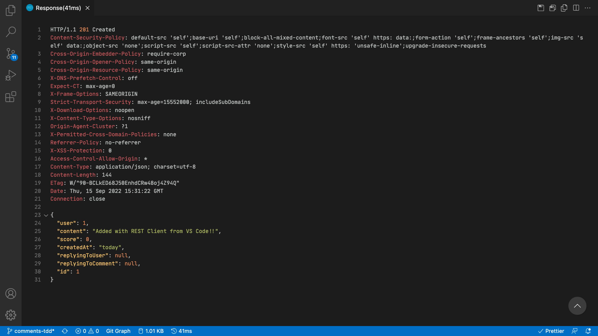

# Interactive comments section backend



## Links

- [The deployed API **(only serves authenticated clients)**.](https://rainy-eggnog-production.up.railway.app)
- [Repository for the frontend.](https://github.com/AngeliqueDF/interactive-comment-section-redux)

The server requires clients (e.g. Next/React apps, Postman, etc…) to provide an id and a secret phrase.

When an unauthenticated client sends a request to the API, the server will return a `401 Unauthorized` response.

### How to authenticate your app

1. Create a `.env` file in the project's root folder:

```
touch .env
```

2. Add the following lines with the corresponding values (also see `.env.example`):

```
# Choose an id for your frontend app
REACT_APP_CLIENT_ID=abc

# Choose a passphrase for your frontend app
REACT_APP_CLIENT_SECRET=xyz
```

3. Repeat 1. and 2. in your frontend project.
